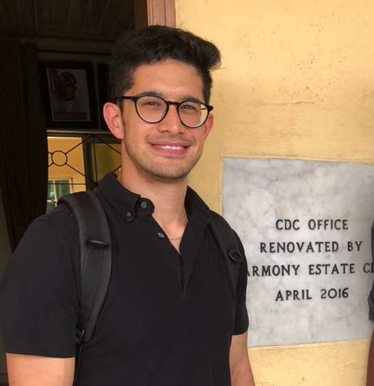

::: column-page
## Bio

I am a PhD Candidate in Political Science at the Massachusetts Institute of Technology, where I am a Graduate Fellow at the [Global Diversity Lab](https://globaldiversitylab.mit.edu/). I study comparative political behavior, with a focus on urban politics in sub-Saharan Africa. My dissertation examines how urban mobility shapes political participation in Lagos, Nigeria. Other research interests include ethnic politics and public service provision.

Before academia, I worked in international development in Washington, DC and in Dhaka and Cox's Bazar, Bangladesh. I received an undergraduate degree in Public Policy Analysis and Anthropology from Pomona College.

[CV](docs/kalow_cv2.pdf)

## Publications

Charnysh, Volha, Jared Kalow, Evan Lieberman, and Erin Walk, 2024. "How Information About Historic Carbon Emissions Affects Support for Climate Aid: Evidence from a Survey Experiment." *Climatic Change*. [**Link**](https://link.springer.com/article/10.1007/s10584-024-03826-y)

Seager, Jennifer, Sarah Baird, Jared Kalow, and Saladin Tauseef, 2023. "Locking Down Adolescent Hunger: COVID-19 and Food Security in Bangladesh." *Applied Economic Perspectives and Policy.* [**Link**](https://onlinelibrary.wiley.com/doi/pdf/10.1002/aepp.13360)

## Working papers

Roving Citizens: Commuting, Urban Mobility, and Political Participation in Developing Democracies (*job market paper*)

Demanding Diversity or Avoiding Differences? Demographic Preferences in Nigeria

Nationality, Race, and Support for Those Affected by Climate Change: Evidence from a Survey Experiment in the U.S. (with Volha Charnysh, Evan Lieberman, and Erin Walk), *Conditionally Accepted*

## Research in progress

Roving Citizens, Stationary Institutions: Urban Mobility and Political Behavior in Developing Democracies (*dissertation*)

Urban Mobility, Exposure, and Policy Preferences: An Experimental Study in Lagos, Nigeria

If You Build It, They Will Vote: How Infrastructure Builds Support for Public Transit (with Justin de Benedictis-Kessner and Toby Nowacki)

Registration Mismatch in African Democracies (with Marco Castradori)

---
[Website template by Apoorva Lal](https://github.com/apoorvalal/minimal_website);

:::

